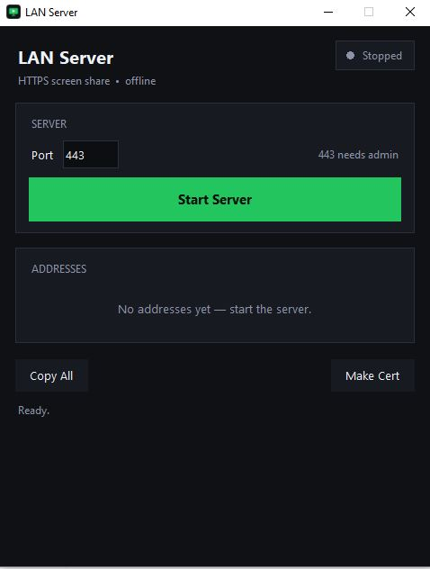
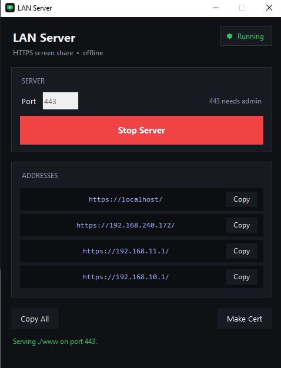
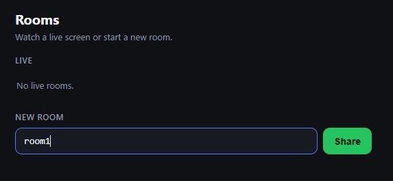
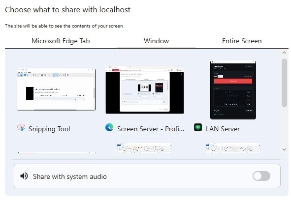
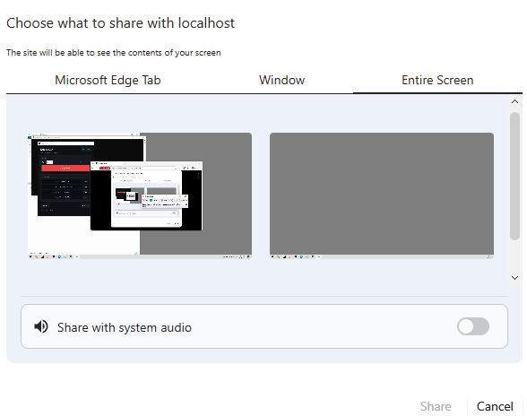

# LANServer

Tiny HTTPS server for LAN screen sharing, with a Tkinter control panel and a minimal WebRTC signaling API.

It serves the pages in `www/` (`Sharer.html`, `Viewer.html`) over TLS, redirects plain HTTP to HTTPS, and exposes a few `/api/*` endpoints so sharers and viewers can exchange offers/answers on the local network. Self-signed ECDSA certificates are generated with the standard library only — no OpenSSL needed.

## Features

- HTTPS static file server + HTTP → HTTPS redirect
- WebRTC signaling API (offers, answers, rooms, sharer heartbeat)
- Tkinter GUI: pick a port, Start/Stop, copy LAN addresses
- Self-signed certs (stdlib only, SANs for LAN IPs)
- Single-file Windows build via PyInstaller (`build.bat`)

## Screenshots

### 1. Start the server

Open the app, pick a port, and press **Start Server**. Copy one of the LAN addresses for the other devices.




### 2. Create a room

Open the address in a browser, type a room name, and press **Share**.



### 3. Choose what to share

The browser asks what to share — a single window or the entire screen.




### 4. Sharing live

The sharer view shows the stream with the viewer count on top.


### 5. Watch from another device

The room appears as live — press **Watch** to view the shared screen.


## Requirements

- Python 3.10+ (standard library only, no third-party deps to run)
- PyInstaller only for building the `.exe` (installed automatically by `build.bat`)

## Quick start

```bash
# Launch the GUI (port, Start/Stop, copy addresses)
python main.py

# Headless server on default port 443
python main.py --serve

# Headless server on a custom port
python main.py --serve 8443

# Serve another folder
python main.py --serve 8443 --dir ./site
```

First run creates `cert.pem` / `key.pem` next to `main.py` (or next to the `.exe` when frozen). Browsers will warn about the self-signed cert — accept it once on each client, or install the cert.

## Build the .exe (Windows)

```bat
build.bat
```

Output: `dist\LANServer.exe` (one file, GUI, no console). Double-click it — the GUI starts and certs are created automatically.

## Project layout

```text
main.py            entry point (GUI or --serve)
core/config.py     all settings in one Config dataclass
core/certs.py      self-signed ECDSA certificates (stdlib only)
core/net.py        local IPs and public URLs
core/signaling.py  thread-safe viewer offer/answer store
core/server.py     https server + http redirect + ServerManager
core/gui.py        Tkinter control panel
www/               served pages (Sharer.html, Viewer.html, ...)
```

## Configuration

Defaults live in `core/config.py`:

| Setting | Default | Notes |
|---|---|---|
| `https_port` | `443` | needs admin rights on Windows |
| `http_port` | `80` | best-effort redirect listener |
| `www_dir` | `www/` | served folder |
| `cert_file` / `key_file` | `cert.pem` / `key.pem` | auto-generated |
| `sharer_timeout` | `15` s | room dropped after no heartbeat |

CLI flags: `--serve [PORT]`, `--dir PATH`, `--https-port PORT`, `--http-port PORT`.

## API

- `GET /api/rooms` — list active rooms
- `GET /api/offers?room=` — list viewer offers in a room
- `GET /api/answer?id=&room=` — fetch an answer (404 `not-ready` if missing)
- `POST /api/offer` `{id, sdp, room}` — publish a viewer offer
- `POST /api/answer` `{id, sdp, room}` — publish an answer
- `POST /api/claim` `{room}` — sharer claims the next offer (404 `empty`)
- `POST /api/leave` `{id, room}` — remove an offer/answer
- `POST /api/sharer/heartbeat` `{room}` / `POST /api/sharer/leave` `{room}`

## License

MIT — see [LICENSE](LICENSE).
