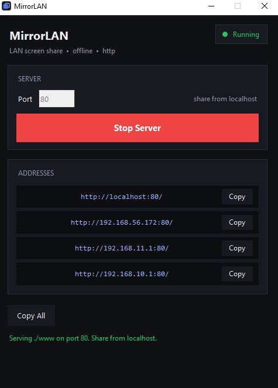
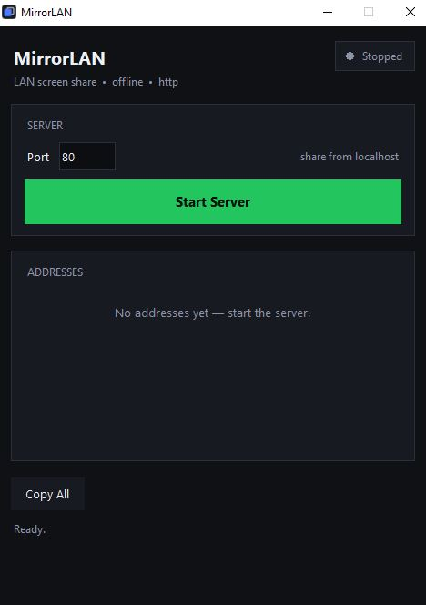
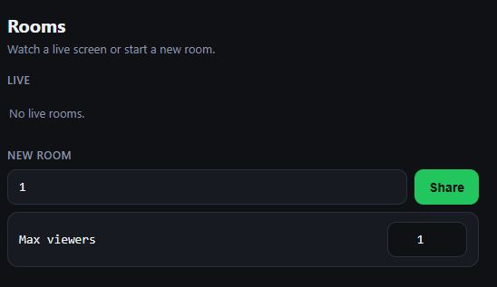
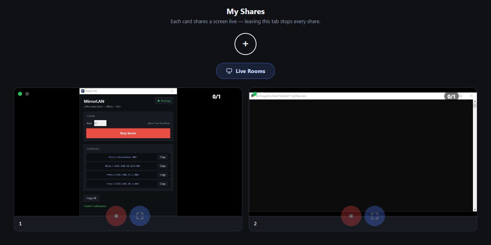
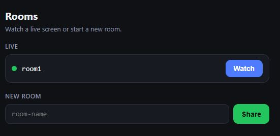

# MirrorLAN

Tiny HTTP server for LAN screen sharing, with a Tkinter control panel and a minimal WebRTC signaling API.

It serves the pages in `www/` (`Sharer.html`, `Viewer.html`) over plain HTTP and exposes a few `/api/*` endpoints so sharers and viewers can exchange offers/answers on the local network. No TLS, no certificates, no setup.

> **Important browser limitation:** screen capture works **only from `http://localhost` on the sharing PC** — browsers disable it on `http://LAN-IP` (secure-context rule). Other devices on the LAN can **watch**, but only the PC running the server can **share**. The rooms page tells LAN visitors exactly that.



## Features

- Plain-HTTP static file server (no certificates, no warnings)
- WebRTC signaling API (offers, answers, rooms, sharer heartbeat)
- Built-in TURN/UDP relay (stdlib only) — automatic fallback when direct browser-to-browser media is blocked (mDNS filtered, AP isolation, VPN); pages use it with zero setup
- Tkinter GUI: pick a port, Start/Stop, copy LAN addresses
- Single-file Windows build via PyInstaller (`build.bat`)

## How it works

1. The **sharer** opens `http://localhost/` **on the sharing PC itself**, types a room name, and presses **Share** — the page captures the screen/window and sends a heartbeat so the room stays listed as live.
2. A **viewer** on another device opens `http://<LAN-IP>/`, sees the live room, and presses **Watch** — the page posts a WebRTC offer to `/api/offer`.
3. The sharer claims the offer (`/api/claim`), replies with an answer (`/api/answer`), and the viewer picks it up.
4. Video/audio then flows **directly browser-to-browser** (WebRTC peer connection) — the server only relays the signaling, it never sees the media. When the direct path cannot form (see [mDNS / black screen](#phone-shows-a-black-screen-pc-works)), both pages automatically fall back to the built-in TURN relay on UDP `3478`: relay candidates carry the server's literal IP, so no multicast DNS is needed. Relayed media stays DTLS-SRTP encrypted end-to-end — the server forwards opaque packets it cannot decrypt.

Rooms are in-memory only: a room disappears ~15 s after the sharer closes the page (missed heartbeats), and everything is cleared on server restart. Room names allow `a-z 0-9 - _` only, max 32 chars. Signaling is lightweight polling (1 s ticks, keep-alive connections) — typical join takes ~1–2 s. Unclaimed offers and undelivered answers expire after 90 s so crashed viewers never clog the queue; live viewers refresh automatically.

**Max viewers** (default 1, up to 99) is chosen when creating the room. The sharer serves at most that many viewers — the badge shows `viewers/max` — and extra viewers wait: after ~12 s without a slot the viewer page shows "Waiting for a free slot", then connects automatically when someone leaves. If no answer arrives within ~30 s the viewer restarts its attempt automatically (same id), so a lost handshake can never strand it on black. When a viewer closes the page the slot frees instantly; brief network blips get a 5 s grace before the slot is released. If an active viewer's connection drops (server or network), the viewer page retries automatically with backoff (2s…15s) until the stream returns — pressing ✕ (Leave) stops retrying.

## Screenshots

### 1. Start the server

Open the app, pick a port, and press **Start Server**. Copy one of the LAN addresses for the other devices.




### 2. Create a room

On the sharing PC, open `http://localhost/` in a browser, type a room name, set **Max viewers** (1–99, default 1), and press **Share**.



### 3. Choose what to share

The browser asks what to share — a single window or the entire screen (see [Monitor capture](#monitor-capture) · [Window capture](#window-capture)).


### 4. Sharing live

The sharer view shows the stream with the viewer count on top.



### 5. Watch from another device

The room appears as live — press **Watch** to view the shared screen.



## Monitor capture

Share a full display through the browser picker (`Entire Screen` tab):

1. On the rooms page, type a room name and press **Share**.
2. In the browser dialog, open the **Entire Screen** tab, pick the display, optionally enable **Share with system audio**, and confirm.

Behavior:

- **Frame rate**: requested at ~15 fps (up to 30) — smooth enough for demos and docs while staying light on the LAN.
- **Audio**: system audio is requested when the browser allows it; if the browser refuses audio, sharing continues video-only automatically. The sharer page shows a green dot (top-left) when an audio track is really captured, gray when video-only — so check it first if the viewer hears nothing. On the viewer side, a volume slider + mute button appear at the bottom whenever the stream carries audio (video-only streams show a no-sound badge instead).
- **Cursor**: the mouse pointer is part of the capture, as rendered by the OS.
- **Viewer count**: the badge on the sharer page shows live WebRTC connections.
- **Stop**: red stop button, the browser's own "Stop sharing" control, or just close the tab — the room is freed immediately (closing the tab also notifies the server, otherwise the room drops after ~15 s of missed heartbeats).
- **Offline-friendly**: everything stays on the LAN and works without internet — direct peer paths first, built-in TURN relay as automatic fallback.

### Extend display to any browser device

Turn any phone, tablet, or TV browser into a wireless second monitor:

1. On Windows, extend your desktop: **Settings → System → Display → Extend these displays** (or `Win+P` → Extend). With a single physical screen, create a virtual one with https://github.com/VirtualDrivers/Virtual-Display-Driver


2. In MirrorLAN, press **Share** and pick the extended/virtual display under the **Entire Screen** tab.
3. Open the room from the other device's browser and press **Watch** — it now shows your second screen.

## Window capture

Share one app window instead of the whole screen (browser picker → `Window` tab):

1. On the rooms page, type a room name and press **Share**.
2. In the browser dialog, open the **Window** tab, pick the app window, and confirm.

Behavior:

- The window picture is **isolated**: overlapping windows on your desktop do not leak into the stream.
- **Close the shared window**: capture ends automatically (track-ended detection) — sharing stops and the room is freed, no stuck "live" room.
- **Minimize**: the stream keeps running; what viewers see while minimized depends on the browser (usually the last frame).
- Same URL/heartbeat/viewer-count behavior as monitor mode. Switching between window and screen requires pressing Share again and picking a new source.

## Requirements

- Python 3.10+ (standard library only, no third-party deps to run)
- PyInstaller only for building the `.exe` (installed automatically by `build.bat`)

## Quick start

```bash
# Launch the GUI (port, Start/Stop, copy addresses)
python main.py

# Headless server on default port 80
python main.py --serve

# Headless server on a custom port
python main.py --serve 8081

# Serve another folder
python main.py --serve 8081 --dir ./site
```

Headless mode prints the LAN addresses to the console.

Share from `http://localhost/` on the sharing PC. Other devices on the same network open `http://<LAN-IP>/` (or your custom port) and press **Watch** — watching works from anywhere on the LAN, sharing only from localhost.

GUI buttons:

- **Copy** / **Copy All** — copy one or all LAN addresses to the clipboard

## Build the .exe (Windows)

```bat
build.bat
```

Output: `dist\MirrorLAN.exe` (one file, GUI, no console). Double-click it — the GUI starts, no setup needed.

## Project layout

```text
main.py            entry point (GUI or --serve)
core/config.py     all settings in one Config dataclass
core/net.py        local IPs and public URLs
core/signaling.py  thread-safe viewer offer/answer store
core/server.py     http server + ServerManager (shared CORS mixin)
core/turn.py       minimal TURN/UDP relay (RFC 5766 subset, stdlib only)
core/gui.py        Tkinter control panel
www/shared.css     stage theme shared by Sharer/Viewer
www/shared.js      stage helpers (toast, fullscreen, room parsing, autoplay…)
www/               pages + per-page assets (index, Sharer, Viewer,
                   myshares — each as .html + .css + .js)
```

## Configuration

Defaults live in `core/config.py`:

| Setting | Default | Notes |
|---|---|---|
| `port` | `80` | plain-HTTP listener (ports < 1024 need admin on Windows) |
| `turn_port` | `3478` | TURN/UDP relay listener (`0` = disabled) |
| `turn_realm` | `MirrorLAN` | TURN auth realm |
| `www_dir` | `www/` | served folder |
| `sharer_timeout` | `15` s | room dropped after no heartbeat |

CLI flags: `--serve [PORT]`, `--dir PATH`, `--port PORT`, `--turn-port PORT`.

## API

- `GET /api/rooms` — list active rooms
- `GET /api/diag` — last signaling events (offer/answer/leave with client IP + candidate counts) for debugging
- `GET /api/turn` — time-limited TURN credentials (`{urls, username, credential, ttl}`) for the relay fallback (`503` while the relay is down — pages then use host candidates only)
- `GET /api/offers?room=` — list viewer offers in a room
- `GET /api/answer?id=&room=` — fetch an answer (`200 {"waiting": true}` while none is posted yet)
- `POST /api/offer` `{id, sdp, room}` — publish a viewer offer (browsers also send `cands`: their ICE candidate count)
- `POST /api/answer` `{id, sdp, room}` — publish an answer (sharer also sends `cands`)
- `POST /api/claim` `{room, known, accept}` — sharer claims the next offer (`200 {"waiting": true, "gone": [...]}` when the queue is empty); both answers carry `gone: [...]` — served viewer ids that pressed Leave (matched against the sharer's `known` id list), so the sharer drops them within ~1 s instead of waiting ~10 s for ICE timeout. `accept: false` serves only re-offers from known ids without touching the waiting queue (full rooms); a re-offer from a served viewer always replaces its stale link, so a returning viewer can never strand on black
- `POST /api/leave` `{id, room}` — remove an offer/answer and notify the sharer
- `POST /api/sharer/heartbeat` `{room}` / `POST /api/sharer/leave` `{room}`

## Security

LAN-trust model — anyone on your local network with the URL can create and watch rooms:

- Traffic is **plain HTTP, not encrypted** — signaling (room names, SDP) travels in cleartext on your LAN. Media stays DTLS-SRTP encrypted browser-to-browser (including over the TURN relay), but assume the LAN itself is trusted.
- There is **no password or access code** — for a trusted home/office LAN only, do not expose to the internet.
- Abuse limits: room names `a-z 0-9 - _` (max 32), viewer IDs (max 64), SDP blobs (max 200 KB) — oversized/invalid signaling is rejected (`400`, bodies over 256 KB get `413` with the connection closed).
- The HTTP API sends `Access-Control-Allow-Origin: *` (handy for local dev, open by design).

## Troubleshooting

- **Ports below 1024 need admin** — the default `80` needs administrator/root; use a port like `8080` to run without elevation.
- **Windows Firewall prompt** on first start — allow access for private networks so other devices can connect.
- **Page errors right after an update (e.g. `X is not defined`)** — stale cached `shared.js`: the server sends `Cache-Control: no-cache` on all pages/scripts/styles so browsers always revalidate; if it still happens, hard-refresh with `Ctrl+Shift+R` (or `Cmd+Shift+R` on Mac).
- **"Cannot bind port"** — another app uses the port; pick a different one.
- **Room stays listed after closing** — it drops automatically after ~15 s of missed heartbeats.
- **Share button says capture is blocked** — expected on `http://LAN-IP`: open the page as `http://localhost/` on the sharing PC itself.

### Phone shows a black screen (PC works)

1. **Same room, same spelling** — the viewer URL must carry the exact room name (`?room=...`). Easiest: open the rooms list on the device and press **Watch** there instead of typing the URL. Since this version the page itself tells you: `room "X" is not live — check the name` means exactly this.
2. **Same Wi-Fi** — the phone must be on the same Wi-Fi network as the PC, not mobile data.
3. **Use Chrome (Android) or Safari (iPhone)**, updated — in-app browsers and old versions may lack WebRTC.
4. **Check the sharer page viewer count** after pressing Watch on the phone:
   - Count goes up but still black → the video path is blocked: disable **AP/client isolation** (or "guest mode") on the router, or try another phone/hotspot.
   - Count stays 0 → the phone never reached the server: recheck steps 1–2 and the IP address.
   - Log stops after `connected - receiving screen` with no `connection:` lines at all → the device gathered zero ICE candidates (UDP blocked at OS level: firewall, antivirus, VPN, or proxy — hits every browser equally). The viewer log says `offer sent (0 local candidates)` in that case; open `http://<LAN-IP>/api/diag` from any device to confirm.
   - Log shows `conn=new/ice=new` and every candidate ends with `.local` → multicast DNS is blocked (browsers hide LAN IPs behind mDNS, each side must resolve the other's `*.local` over UDP 5353). The built-in TURN relay now covers this automatically: look for `turn: … (relay fallback ready)` and `typ relay` candidates in the log — the relay path needs only UDP `3478` to the server, no mDNS at all. If the log says `turn unavailable`, check the server console/GUI for `(turn relay off)` and free UDP port `3478` (or set `--turn-port`). Manual fallback (diagnostic): on **BOTH** browsers open `edge://flags` (or `chrome://flags`), switch off **"Anonymize local IPs exposed by WebRTC"**, relaunch — candidates become literal `192.168.x.x`. If it stays black with literal IPs on both sides and the log moves to `ice: checking → failed`, the culprit is plain UDP blocking (firewall/AP isolation) instead — the relay path should still connect; otherwise allow inter-client UDP or keep both devices on the same AP/band.
5. **No sound on the phone** — use the volume slider at the bottom of the viewer page (a no-sound badge means the shared source itself has no audio).

## License

MIT — see [LICENSE](LICENSE).
